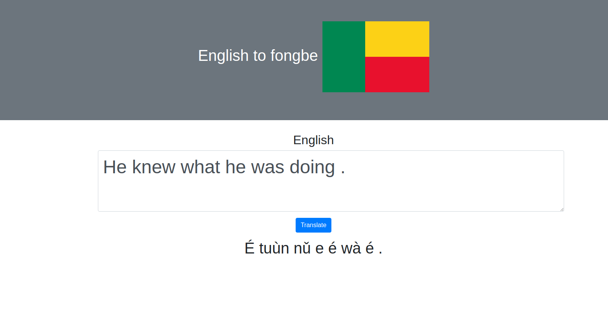

# Flask-Joey: Deploy your Joey NMT model as a flask app

I created this app to serve our English to Fongbe translation model, but 
you can use it as a template to serve your model too without much coding.
The model used was created using this
 [notebook](https://github.com/masakhane-io/masakhane/blob/master/starter_notebook.ipynb)
  from the [Masakhane](https://www.masakhane.io/) project.
  
  


## Setup

## Clone this repository
```sh
git clone https://github.com/kevindegila/flask-joey
```
## Install
cd into the repo and Create a python 3.7 virtual environment with your desired
env manager. Here is an exemple with conda:
```sh
cd flask-joey && conda create --name translator python=3.7
```
Activate the environment and install all the requirements:
```sh
conda activate translator && pip install -r requirements.txt
```


## Customize to serve your model

* Your model : A checkpoint file named `best.ckpt`  should be in the
`transformer` older 
* The source and target vocabulary named `src_vocab.txt` and `trg_vocab.txt `
 should be in the `transformer` folder.
 
 * You don't need to change the config.yaml if you have a BPE based
 model.
 
* Change the flag if your language is not from Benin :smile: . Just replace
 the image in the `static` folder and don't forget to update the name of
 the file in the `index.html` present in the `templates` folder. No need to
 say you should change the title as well.
 
 ----
The model can be quite big and Github have restrictions on the size of your 
free repos. You can host your model on google drive as I do. 
If you want to try the English to fongbe model :blush: , you can download it here:
https://drive.google.com/open?id=1PbrojtNSeZf8QpYmgJXtbcgYijVUU7Ay

I've left the vocab files in the repo. Just replace them with yours if you
want to try your trained model.

## Running the App
You can run the app with this commmand and start making predictions
```sh
gunicorn -b 0.0.0.0:8080 app:app
```
and go to localhost:8080 to interact with the app

### Credits

Thanks to the [Masakhane](https://github.com/masakhane-io/masakhane) community for providing everything needed
 to start this project: data, code and guidance. Join us in our effort to bring
 Africa on the Machine Translation Map

Thanks to [Julia](https://github.com/juliakreutzer/) 
for [JoeyNMT](https://github.com/joeynmt/joeynmt)
and [Slack-joey](https://github.com/juliakreutzer/slack-joey).
This is based off her work. I just added a simple front end and the flask code.
